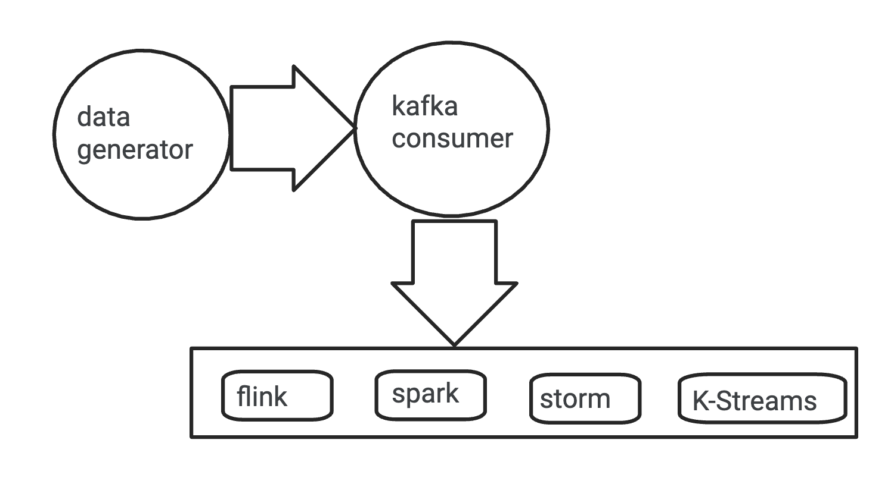

# Data streaming POC

Building an end-to-end data streaming pipeline, with data generator, consumer and processor modules, using well 
established open-source libraries:
* [Apache Kafka](https://kafka.apache.org/)
* [Apache Kafka - Kafka Streams](https://kafka.apache.org/documentation/streams/)
* [Apache Flink](https://flink.apache.org/)
* [Apache Spark - Spark Streaming](https://spark.apache.org/docs/latest/streaming-programming-guide.html)
* [Apache Storm](https://storm.apache.org/)

This project applies [Diamond Architecture](https://en.wikipedia.org/wiki/Hexagonal_architecture_(software)) design 
patterns and follows a [Kappa Architecture](https://www.newsletter.swirlai.com/p/sai-13-lambda-vs-kappa-architecture) 
data processing strategy.

## Diamond Architecture

The modules in this project follow the diamond architecture nomenclature: `<level>-<type>-<function>-<library>`

There can be as many levels as needed, but the recommendation is not less than three and not more than five. There are 
three levels in this project:
* 01: Interfaces
* 02: Implementations
* 03: Composition of interfaces to run the project

There can be as many types of modules as needed, but with the following four, most of the cases should be covered:
* i: Input modules that bring data into the project's pipeline
* c: Common modules that share functionality across the project
* u: Util modules that help modules that share the same underlying library
* o: Output modules that process the data and send it somewhere outside the project

The function of the modules will vary based on the project's needs. In this PoC we used the following:
* configuration: load the project's configuration 
* consumer: consumes the data from upstream sources
* core: holds the business model and logic
* dataGenerator: generates dummy data (replaces upstream sources)
* processor: applies the business logic to the data and sends it to the external sinks

Finally, the last tag, libraries, refers to the main library of the given module (when applicable).

For example, the configuration module is simply named as `02-c-config` and the flink processor is
`02-o-processor-flink` because we have multiple libraries used for processing.

## Kappa Architecture

For more information, see [specification](https://docs.google.com/document/d/1f6vxfJrBA8dylbEGMHsJIcjHEztaYu5BHjoTB-XHvw8).

The actual state of the Poc is: 

### Pre-requisites

* [JDK](https://openjdk.org/projects/jdk/20/)
* [SBT](https://www.scala-sbt.org/download.html)
* [Docker Compose](https://docs.docker.com/compose/install/linux/)
* [Kafkacat](https://formulae.brew.sh/formula/kcat)

### How-to

#### Sanity checks

* Compile -> `sbt compile`
* Format -> `sbt styleFix`
* Test -> `sbt test`
* Code Coverage -> `sbt runCoverage`
* Run Flink integration tests -> `sbt flinkIT`

#### Integration checks

* Start docker images -> `docker-compose up -d`
* Inspect Kafka topics -> `kcat -b localhost:9092 -L`

### License

`Apache-2.0`, see [LICENSE](LICENSE.md)
